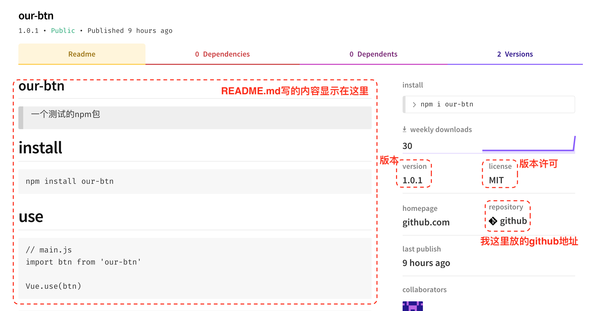
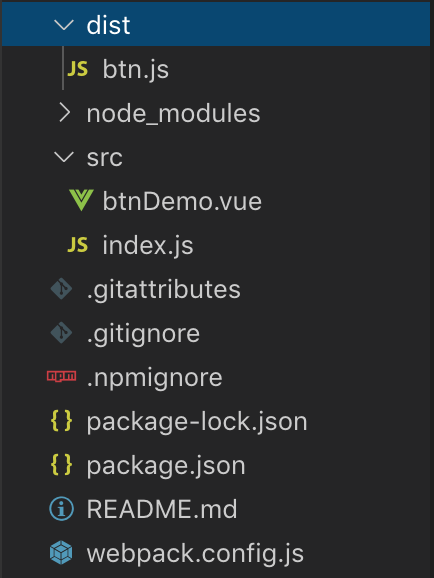
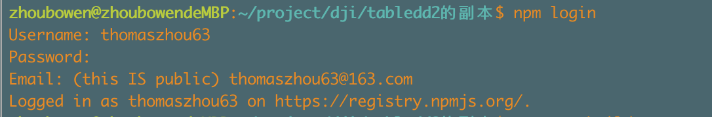
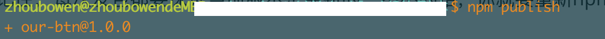

# 这会让一个小白学会发npm包

​	相信前端er对npm包不会陌生，[npm](https://www.npmjs.com/) 本来是 Node.js 的包管理工具，但随着 JS 这几年的蓬勃发展，现在的 npm 已经成了几乎所有跟 JS 相关的工具和软件包的管理工具了，这次也会从0到1的走一遍发包的流程，

> [发包项目代码在这里](https://github.com/thomaszhou63/test-npm)、 [npm包地址在这里](https://www.npmjs.com/package/our-btn)

> 1、本文是以vue项目为例子进行讲解，流程可通用，只是具体项目的安装有些许区别，不管vue还是react，相信对大家都有帮助
>
> 2、**⚠️提示⚠️：**为了让童鞋们理解发包的流程和配置，所以还是建议按照步骤（1）-（10）的顺序来操作，为了突出整个发包流程，所以封装的测试组件非常简单。待理解所有文件的内容和具体原理，并成功发出一个测试npm包后，童鞋们可自行更换成自己的组件，发布属于自己的npm包，**发布包的名字设置为```our-btn```**

## 初始化webpack项目 + 组件封装 ===  一气呵成

​	在项目中，我们都希望安装的插件体积尽可能的小，因此，我们在发包的时候也要尽量控制我们的依赖，所以我选择自己创建一个打包项目，而不是用笨重的vue和react脚手架。 话不多说，下面跟着做👇

- **（1）下方是推荐的目录结构，根据以下结构建立项目文件**

> 但是由于本文组件过于简单，所以删减```assets```、```utils```文件夹（有没有这两个文件夹不影响npm发包，仅仅方便你自己整理项目代码）

```
├── src
│ ├── assets # 本地静态资源（本文没有）
│ ├── components # 业务通用组件
│ │ ├── btnDemo.vue # 本文需要封装的简单button组件
│ ├── utils # 工具库（本文没有）
│ └── index.js # 应用入口 
├── .npmignore // 用于忽略不需要上传到npm的文件
├── README.md
├── package-lock.json
├── package.json
└── webpack.config.js # webpack配置

// 注意
# utils 文件夹一般存放的是你组件经常使用的一些工具函数
# assets 文件夹一般存放的是你组件用到的样式、图片、icon等静态资源
```

- **（2）```button组件```**

```js
// btnDemo.vue
<template>
  <div class="btn">
    <button>{{text}}</button>
  </div>
</template>

<script>
export default {
  name: 'btn', // 组件的name属性（后面有提到这里有个坑）
  props: {
    text: { // 文本
      type: String,
      default () {
        return ''
      }
    }
  },
  data () {
    return {
    }
  }
}
</script>
```

- **（3）```index.js ```**

该文件是为了将我们的组件暴露出去

```js
// src/index.js
// 这里import 的 btn和btnDemo.vue的name属性名相同 ！

import btn from './btnDemo.vue'

btn.install = Vue => Vue.component(btn.name, btn) // 给组件配置install方法 

export default dtable;
```

> ⚠️（这里有个坑）：由于```Vue.component(btn.name, btn)```的```btn.name```是指向```btnDemo.vue```的```name```属性，因此，建议在这里最好用组件的```name```属性值作为```import```别名

- **（4）```webpack.config.js```**

> ```webpack.config.js```配置如下，由于我们使用的版本是```webpack4```，所有的配置都在```webpack.config.js```里面，在我们这里仅仅需要把我们的资源打包，写的比较简单，具体```webpack```配置细节可以学习[官方文档](https://webpack.js.org/contribute/)

这里配置是用于将`/src`中的内容打包到`/dist`（打包时会自动生成`/dist`文件夹）中的```btn.js```，```btn.js```其实就相当于我们的插件（后面在```package.json```的```main```字段也是指向这里）

```js
// webpack.config.js
const path = require('path')
const { VueLoaderPlugin } = require('vue-loader')

module.exports = {
  entry: {
    index: path.join(__dirname, "/src/index.js") // 入口文件（就是刚才用于暴露组件的index.js）
  }, 
  output: {
    path: path.join( __dirname, "/dist"), // 打包后的文件存放在dist文件夹
    publicPath: '/dist/', // 设置公共路径
    filename: "btn.js", // 打包后输出文件的文件设置为btn.js
    libraryTarget: 'umd' // 这个选项会尝试把库暴露给前使用的模块定义系统，这使其和CommonJS、AMD兼容或者暴露为全局变量
  },
  module: {
    rules: [
      {
        test: /\.vue$/,
        loader: 'vue-loader'
      },
      {
        test: /\.css$/,
        use: ['style-loader', 'css-loader']
      },
      {
        test: /\.(scss|sass)$/,
        use: ['style-loader', 'css-loader', 'sass-loader']
      },
      {
        test: /\.(png|jpg|svg|gif)$/,
        use: ['url-loader']
      },
      {
        test: /\.js$/,
        exclude: /node_modules|vue\/dist|vue-router\/|vue-loader\/|vue-hot-reload-api\//,
        loader: 'babel-loader'
      }
    ]
  },
  plugins: [
    new VueLoaderPlugin()
  ]
}
```

- **（5）```package.json```**

```package.json```字段如下，要强调的是，字段```devDependencies```中的依赖项不唯一，你可以根据自己情况去写，**但是此时此刻，请务必和我一样，这也是为了保证你可以按照我的操作，成功发包**

```
// 具体字段后面详细说明
{
  "name": "our-btn", // 发布npm包的名字
  "version": "1.0.0", // 你的npm包版本
  "description": "A test button", // 包的描述
  "main": "dist/btn.js", // *重点*：指定你组件的主入口文件
  "scripts": {
    "build": "webpack --mode production",
    "dev": "webpack-dev-server --open --mode development"
  },
  "keywords": [
    "our-btn",
    "button"
  ],
  "repository": {
    "type": "git",
    "url": "git+https://github.com/thomaszhou63/test-npm.git"
  },
  "author": "thomaszhou",
  "license": "MIT",
  "devDependencies": {
    "babel-core": "^6.26.3",
    "babel-loader": "^7.1.5",
    "babel-preset-env": "^1.7.0",
    "css-loader": "^1.0.0",
    "file-loader": "^2.0.0",
    "style-loader": "^0.23.1",
    "url-loader": "^1.1.2",
    "node-sass": "^4.12.0",
    "sass-loader": "^7.2.0",
    "vue": "^2.5.2",
    "vue-hot-reload-api": "^2.2.4",
    "vue-html-loader": "^1.2.4",
    "vue-loader": "^15.4.2",
    "vue-style-loader": "^3.0.3",
    "vue-template-compiler": "^2.5.9",
    "webpack": "^4.19.0",
    "webpack-cli": "^3.1.0"
  }
}
```

- 参数说明
  - ```name``` - 包名（包名应该是kebab-case, 即英文单词全小写或者中划线分割）
  - ```version``` - 包的版本号（第一版建议```1.0.0```，具体命名规则[看这里](https://www.npmjs.cn/getting-started/semantic-versioning/)）
  - ```description``` - 包的描述。在```npmjs.com```上搜索时会显示，有助于用户在搜索时进行筛选）
  - ```keywords``` - 关键字（在npm网站上搜索你这个npm包的关键词）
  - ```author``` - 包的作者。格式一般是```name <你的邮箱>```，一般来说，用```vue/react```脚手架创建项目的时候会默认这个格式写法, 当然也可以是一个github地址，也可以自定义，但就不那么标准了
  - ```license``` - 版权许可证，```MIT```还是```ISC```，或者其他都可以，只是我看很多包都是```MIT```
  - ```contributors``` - 包的其他贡献者(我没有写这个)
  - ```repository``` - 包代码的```Repo```信息，包括```type```和```URL```，```type```可以是```git```或```svn```，```URL```则是包的```Repo```地址
    - 我这里写的```git```仓库的地址，放着我的组件项目代码，这样在npm包页面就有会个github的入口
  - ```main``` - 该字段指定了程序的主入口文件（最好写```dist文件夹```内已经压缩后的文件）
    - ```main```定义了包的入口文件，在```NodeJs```环境中，语句```import [pkg] from '[package]'```时，其实导入的就是main定义的文件
  - ```scripts``` - 指定了运行脚本命令的npm命令行缩写。如 ```npm start```、```npm run dev```、```npm run build```等
  - ```dependencies``` / ```devDependencies``` - 生产/开发环境依赖包列表。它们将会被安装在 ```node_module``` 目录下
    - 对于一个开发者来说，```dependencies```和```devDependencies```其实没太多区别，因为在执行```npm install/yarn add```时都会全部下载
    - ```dependencies``` 是运行你的包必须安装的依赖，即当用户```npm install [package]```或者```yarn add [package]```时，这些依赖也会下载
    - **```devDependencies``` 是开发你的包时需要安装的依赖，比如`eslint`, `jest`等开发工具，当用户```npm install [package]```或```yarn add [package]``` 时，这些依赖并不会下载！**

> 我这里版本是1.0.1，是因为我自己后面迭代了一个版本，如果你是第一版，最好是1.0.0



- **（6）```README.md```**

这是我的```README.md```写的东西，最终都会显示在npm的内容介绍里面（也就是上图），各位童鞋如果发包，也请写好```README.md```哈，毕竟是给人使用的嘛

```
## our-btn
>一个测试的npm包

# install

​```
npm install our-btn
​```
# use
​```
// main.js
import btn from 'our-btn'

Vue.use(btn)
​```
​```
// demo.js
<template>
  <div class="demo">
    <btn :text="msg"></btn>
  </div>
</template>

<script>
export default {
  name: 'demo',
  data () {
    return {
      msg: '成功'
    }
  }
}
</script>
​```
```

- **（7）```.npmignore```**

这个文件同```.gitignore```的功能一样，```.gitignore```是忽略自选的文件上传到github仓库中，而```.npmignore```则是忽略自选的文件上传到npm上。

但是呢，如果你的项目没有```.npmignore```文件，但有 `.gitignore`文件，则发布时会忽略 `.gitignore`中定义的文件;也就是说，```.npmignore```的优先级是高于```.gitignore```的。 

```
.*
*.md
node_modules/
webpack.config.js
src/
```

- **（8）安装依赖**

以上文件都配置好后就可以运行下面命令安装```package.json```的依赖了，然后就会在你们的目录中生成```node_modules```文件夹、```package-lock.json```文件

```js
npm install
```

- **（9）打包我们的组件**

```js
npm run build
```

- **(10) 目录结构**

下图就是我的目录结构，其中```.gitattributes```和```.gitignore```文件你可以忽略，因为我把这个项目放在github仓库，所以才会有这两个文件的。



## 本地测试组件是否可以用

在项目中执行如下命令

```js
npm run build // 打包
npm pack // 本地生成一个our-btn-1.0.1.tgz的包
```

你自己在你本地新建一个```vue/react```项目，因为我是vue组件，所以我就新建一个vue项目，取名为```test-btn```，我们把```our-btn-1.0.1.tgz```放进我们的本地项目```test-btn```中

```js
npm install our-btn-1.0.1.tgz
npm run dev // 启动vue项目
```

然后在项目的```main.js```引入我们的包

```js
// src/main.js
// 注意：btn要保持和之前咱们封装组件的index.js一样
import btn from 'our-btn' // 引入包

Vue.use(btn)
```

在我们demo页面中引用这个组件

```js
// demo.vue
<template>
  <div class="demo">
    <btn :text="msg"></btn> 
  </div>
</template>

<script>
export default {
  name: 'demo',
  data () {
    return {
      msg: '成功'
    }
  }
}
</script>
```

若测试可用，在测试项目```test-btn```中运行```npm uninstall our-btn```卸载插件，然后那么就可以发布到npm包上了

## 发布到npm

- **（1）注册npm账号**

发布之前，你得注册一个npm账号吧，不然你怎么上传呢，建议上[官网注册](https://www.npmjs.com/signup)一个账号（顺便熟悉那个网站），注册完账号之后，我们就要在本地登录并发布我们的组件了

> 提示：因为有点童鞋会经常用cnpm源，所以呢，**一定要切换到npm源上才可以**，不然就会报出如下错误
>
> ```js
> error: no_perms Private mode enable, only admin can publish this module
> ```
>
> 因此你要切换到npm源，通过```npm config set registry http://registry.npmjs.org ```命令

- **（2）开始发布**

在发包之前，先去[npm官网]([https://www.npmjs.com](https://www.npmjs.com/))搜索一下有没有和你包名相同的，如果相同就改一个其他的名字吧

```js
npm login // 登陆npm
// 然后输入你的账号、密码、邮箱
// 当你在控制台看到 Logged in as <Username> on https://registry.npmjs.org  说明登陆成功

// 如果你保证是最新版本且已经打包过，则跳过npm run build这一步
npm run build 
npm publish // 发布你的包（如果你出现👇，显示 +[package]@版本信息 ，那就发布成功了）
```

👇这是我的输入及其对应显示的东西






此时此刻🎉🎉🎉🎉🎉🎉🎉🎉🎉🎉🎉🎉🎉🎉🎉**```我们的包发布成功了```**🎉🎉🎉🎉🎉🎉🎉🎉🎉🎉🎉🎉🎉🎉🎉🎉🎉🎉🎉🎉


> ⚠️**拓展知识**：一个版本只能发布一次，也就是你不能发了```1.0.0```，下次还继续```1.0.0```，理论上可以覆盖，但是npm不允许这样，因为你这样覆盖，就无法知道你的版本信息了啊，插件和项目都是迭代的，like git，室友版本信息的。
>
> ​    方法一：每一次```npm publish```前，自行手动更改```package.json```的version
>
> ​	方法二：通过以下命令来发布
>
> ```js
> 假设初始版本为1.0.0
> ➜ npm version preminor （执行这个命令，就会价格当前包发布为版本v0.1.0-0）
> v1.0.0-0
> ➜ npm version prepatch
> v1.0.1-0
> ➜ npm version patch    （执行这个命令，就会价格当前包发布为版本v1.0.1）
> v1.0.1
> ```

## 查看npm && 使用我们的包

​	这个时候，你稍微等几分钟去[npm官网]([https://www.npmjs.com](https://www.npmjs.com/))搜索一下你的包名字，就可以找到啦。如果搜不到，那就再等等，或许更新慢，没有完全更新，但是你在自己npm账号可以查看到自己发布的包

​	你自己在你本地新建一个```vue/react```项目，因为我是vue组件，所以我就新建一个vue项目，具体使用包的方法就是（以我的测试包为例）

```js
npm install our-btn // 安装我们的包
```

```js
// src/main.js
// 注意：btn要保持和之前咱们封装组件的index.js一样
import btn from 'our-btn' // 引入包

Vue.use(btn)
```

```js
// demo.vue
<template>
  <div class="demo">
    <btn :text="msg"></btn> 
  </div>
</template>

<script>
export default {
  name: 'demo',
  data () {
    return {
      msg: '成功'
    }
  }
}
</script>
```

```如果错误请指正，我也好纠错更新```

```如有讲的不明白的，请留言，我看到会回复```

over