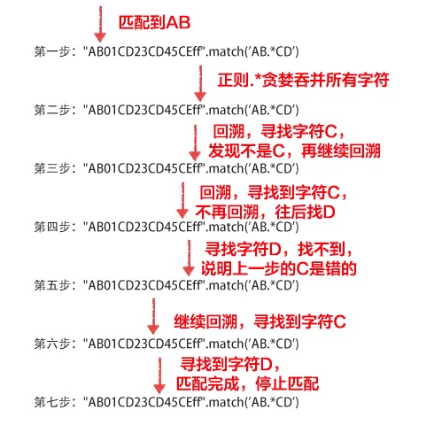

[TOC]

# 正则理论篇

## 字符

`|` 指示在两个或多个项之间进行选择。类似js中的或，又称**分支条件**。

`/` 正则表达式模式的开始或结尾。

`\` 反斜杠字符，用来转义。

`-` 连字符 **当且仅当在字符组[]的内部表示一个范围**，比如[A-Z]就是表示范围从A到Z；如果需要在字符组里面表示普通字符-，放在字符组的开头或者尾部即可。

`.` 匹配除换行符 \n 之外的任何单个字符。

`\d` 等价[0-9]，匹配0到9字符。

`\D` 等价```[^0-9]```，与`\d`相反。

`\w` 与以下任意字符匹配：A-Z、a-z、0-9 和下划线，等价于 [A-Za-z0-9]。

```\W``` 与```\w```相反，即```[^A-Za-z0-9_]```

## 限定符（量词字符）

**显示限定符**位于大括号 {} 中，并包含指示出现次数上下限的数值；`*+?` 这三个字符属于**单字符限定符**：

`{n}` 正好匹配 n 次

`{n,}` 至少匹配 n 次。

`{n,m}` 匹配至少 n 次，至多 m 次。

`*` 等价{0,} 

`+` 等价{1,}

`?` 等价{0,1}

注意：

- 显示限定符中，逗号和数字之间不能有空格，否则返回null！
- **贪婪量词`*`和`+`**：javascript默认是**贪婪匹配**，也就是说匹配重复字符是尽可能多地匹配。
- **惰性（最少重复匹配）量词`?`**：当进行非贪婪匹配，只需要在待匹配的字符后面跟随一个`?`即可。也可以理解为，只要满足条件就不再向后匹配

```js
let str = '1sadssloud.asd12345tb.co'
let reg1 = /\d{2}/
let reg2 = /\d{2,}/ 
let reg3 = /\d{2,3}/
let reg4 = /\d?/ 

console.log(str.match(reg1)) // ['12', index: 14, input: '1sadssloud.asd12345tb.co' ]
console.log(str.match(reg2)) // ['12345', index: 14, input: '1sadssloud.asd12345tb.co' ]
console.log(str.match(reg3)) // ['123', index: 14, input: '1sadssloud.asd12345tb.co' ]
console.log(str.match(reg4)) // ['1', index: 0, input: '1sadssloud.asd12345tb.co' ]
```

*（等价{0,} ）和?等价{0,1}的匹配范围的左边界都是0，那么就有可能匹配不到

```js
let str = 'sa44d'
let str2 = '44d'
let reg1 = /\d*/
let reg2 = /\d+/
let reg3 = /\d?/

// *匹配第一个字符不是数字，但是符合{0,} ，结果输出''，匹配不到数字
console.log(str.match(reg1)) // ['', index: 0, input: 'sa44d', groups: undefined]
console.log(str2.match(reg1)) // ['44', index: 0, input: '44d', groups: undefined]

console.log(str.match(reg2)) // ['44', index: 2, input: 'sa44d', groups: undefined]
console.log(str2.match(reg2)) // ['44', index: 0, input: '44d', groups: undefined]

console.log(str.match(reg3)) // ['', index: 0, input: 'sa44d', groups: undefined]
console.log(str2.match(reg3)) // ['4', index: 0, input: '44d', groups: undefined]
```


## 定位点（锚字符、边界）

`^` 匹配开始的位置。将 `^` 用作括号`[]`表达式中的第一个字符，则会对字符集求反
```$``` 匹配结尾的位置
`\b` 与一个字边界匹配，如er\b 与“never”中的“er”匹配，但与“verb”中的“er”不匹配
`\B` 非边界字匹配

```js
let str = 'asadssloud.asd12345tb.co'

let reg1 = /[^\d]{2,}/
// 1s是开头两字符，\b要放在前面才能匹配；co是结尾的两字符，\b放前后都能匹配，为啥？
let reg2 = /\b1s/
let reg3 = /1s\b/
let reg4 = /\bco/
let reg5 = /co\b/
let reg6 = /sa\B/
var reg7 = /\w+\b/g

console.log(str.match(reg1)) // ['sadssloud.asd', index: 1, input: '1sadssloud.asd12345tb.co']
console.log(str.match(reg2)) // [ '1s', index: 0, input: '1sadssloud.asd12345tb.co' ]
console.log(str.match(reg3)) // null
console.log(str.match(reg4)) // [ 'co', index: 22, input: '1sadssloud.asd12345tb.co' ]
console.log(str.match(reg5)) // [ 'co', index: 22, input: '1sadssloud.asd12345tb.co' ]
console.log(str.match(reg6)) // [ 'sa', index: 1, input: 'asadssloud.asd12345tb.co' ]
console.log(str.match(reg7)) // ['asadssloud', 'asd12345tb', 'co']
```

加了```^``` 和```$```之后，匹配的顺序就会相应改变，并且匹配会按照设置的顺序输出第一个匹配的值（不管是否是全局匹配），地下列举了再全局匹配下，加了```^``` 和```$```之后的结果：

```js
var str = "12345678"

var reg1 = /\d{1,3}/g
console.log(str.match(reg1)) // ['123', '456', '78']

var reg2 = /^\d{1,3}/g
console.log(str.match(reg2)) // ['123']

var reg3 = /\d{1,3}$/g
console.log(str.match(reg3)) // ['678']

var reg4 = /^\d{1,3}$/g
console.log(str.match(reg4)) // null
var str2 = '234'
console.log(str2.match(reg4)) // ['234']
```

可以看到reg4匹配的结果为null，是因为在同一正则表达式中加了```^``` 和```$```两者后，该表达式会将整个字符串作为一个待匹配字符串，匹配的结果只有是和否

## 标记

- 中括号`[]` 字符组；标记括号表达式的开始和结尾，起到的作用是匹配这个或者匹配那个。
  `[...]` 匹配方括号内**任意字符**。很多字符在`[]`都会失去本来的意义：`[^...]`匹配不在方括号内的任意字符；`[?.]`匹配普通的问号和点号。
  - 注意：反斜杠字符 `\` 在`[]`中仍为转义字符。若要匹配反斜杠字符，请使用两个反斜杠 `\\`。
    **另外不要滥用字符组这个失去意义的特性，比如不要使用`[.]`来代替`\.`转义点号，因为需要付出处理字符组的代价**。
- 大括号`{}` 标记限定符表达式的开始和结尾（前面讲了）
- 小括号`()` 标记子表达式的开始和结尾，主要作用是分组，对内容进行区分

- `(模式)` 可以记住和这个模式匹配的匹配项（捕获分组）。**不要滥用括号，如果不需要保存子表达式，可使用非捕获型括号`(?:)`来进行性能优化**
  - `(?:模式)` 与模式 匹配，但不保存匹配项(非捕获分组)。
  - `(?=模式)` 零宽正向先行断言，要求匹配与模式 匹配的搜索字符串。 找到一个匹配项后，将在匹配文本之前开始搜索下一个匹配项；但不会保存匹配项
    - 先行断言`(?=模式)`：x只有在y前面才匹配，必须写成`/x(?=y)/`。 解释：找一个x，那个x的后面有y
  - `(?!模式)` 零宽负向先行断言，要求匹配与模式 不匹配的搜索字符串。 找到一个匹配项后，将在匹配文本之前开始搜索下一个匹配项；但不会保存匹配项
    - 先行否定断言`(?!模式)`： x只有不在y前面才匹配，必须写成`/x(?!y)/`。 解释：找一个x，那个x的后面没有y

> 注意：(模式)、(?:模式、(?=模式)、(?!模式)只匹配一个位置

零宽负向先行断言的例子：

```js
let str = 'asad?oud.asd?15tb3.http:/'
// let reg = /[?a]/ // ['a', index: 0, input: 'asad?oud.asd?15tb3.http:/']
// let reg = /[?.]/ // ['?', index: 7, input: 'asad?oud.asd?15tb3.http:/']
// let reg = /(\d(?=\.))/ // ['3', '3', index: 23, input: 'asad?oud.asd?15tb3.http:/']
let reg = /(\d(?!\.))/ // ['1', '1', index: 13, input: 'asad?oud.asd?15tb3.http:/']

console.log(str.match(reg))
```

```js
var str=`<div class="o2">
            <div class="o2_team">
                
            </div>
        </div>`;
// <(?!img) 表示找一个左尖括号<，而且左尖括号<的后面没有img字符；
// (?:.|\r|\n)*? 表示匹配左右尖括号<>里面的.或\r或\n，而且匹配次数为*?；(?:)不保存匹配项，提高性能；
// *后面加个? 表示非贪婪匹配。
var reg = /<(?!img)(?:.|\r|\n)*?>/gi;
console.log(str.match(reg)) 
//输出结果： ["<div class="o2">", "<div class="o2_team">", "</div>", "</div>"]
```

稳住，又来了两个断言，来自ES7提案：（==没懂==）

- 后行断言`(?<=模式)`：与”先行断言”相反， x只有在y后面才匹配，必须写成`/(?<=y)x/`。解释：找一个x，那个x的前面要有y。
- 后行否定断言`(?： 与”先行否定断言“相反，x只有不在y后面才匹配，必须写成`/(?。 解释：找一个x，那个x的前面没有y。

可以看出，后行断言先匹配/(?<=y)x/的x，然后再回到左边，匹配y的部分，即先右后左”的执行顺序。

```

```

- 反向引用：主要作用是给分组加上标识符\n（==没懂==）
  - `\n` 表示引用字符，与第n个子表达式第一次匹配的字符相匹配。

```js
// 反向引用的例子，给MikeMikeMike字符后加个单引号：
var reg = /(Mike)(\1)(s)/;
var str = "MikeMikeMikes";
console.log(str.replace(reg,"$1$2'$3"));
// 返回结果 MikeMikeMike's
```

## ```[]``` 和 ```()``` 的区别

- **圆括号()是组，主要应用在限制多选结构的范围/分组/捕获文本/环视/特殊模式处理**，下面列举一些()的例子进行说明

  - ```(abc|bcd|cde)```，表示这一段是abc、bcd、cde三者之一均可，顺序也必须一致
  - ```(abc)?```，表示这一组要么一起出现，要么不出现，出现则按此组内的顺序出现
  - ```a(?=bbb)``` 顺序环视 表示a后面必须紧跟3个连续的b
  - ```(?:abc)```表示找到这样```abc```这样一组，但不记录，不保存到```$```变量中，否则可以通过```$x```取第几个括号所匹配到的项，比如：```(aaa)(bbb)(ccc)(?:ddd)(eee)```，可以用```$1```获取```(aaa)```匹配到的内容，而```$3```则获取到了```(ccc)```匹配到的内容，而```$4```则获取的是由(eee)匹配到的内容，因为前一对括号没有保存变量

  - ```()```内的内容表示的是一个子表达式，```()```本身不匹配任何东西，也不限制匹配任何东西，只是把括号内的内容作为同一个表达式来处理，例如```(ab){1,3}```，就表示ab一起连续出现最少1次，最多3次。如果没有括号的话，```ab{1,3}```,就表示a，后面紧跟的b出现最少1次，最多3次

- **方括号[]是单个匹配**，字符集/排除字符集/命名字符集,下面列举一些()的例子进行说明

  - ```[0-3]```，表示找到这一个位置上的字符只能是0到3这四个数字，与(abc|bcd|cde)的作用比较类似
  - ```[^0-3]```，表示找到这一个位置上的字符只能是除了0到3之外的所有字符


> **```()```和```[]```的区别: **
>
> （1）**圆括号()是组,可以匹配多个连续的字符，而方括号[]是单个匹配**
>
> （2）**```()```内的内容表示的是一个子表达式，```()```本身不匹配任何东西，也不限制匹配任何东西，只是把括号内的内容作为同一个表达式来处理。```[]```表示匹配的字符在[]中，并且只能出现一次，并且特殊字符写在```[]```会被当成普通字符来匹配**。例如```[(a)]```，会匹配```(```、```a```、```)```、这三个字符

## 非打印字符

`\s` 任何空白字符。即`[ \f\n\r\t\v]`
`\S` 任何非空白字符
`\t` Tab 字符(\u0009)
`\n` 换行符(\u000A)
`\v` 垂直制表符(\u000B)
`\f` 换页符(\u000C)
`\r` 回车符(\u000D)

注意：`\n`和`\r`一起使用，即 `/[\r\n]/g`来匹配换行，因为unix扩展的系统以`\n`标志结尾，window以`\r\n`标志结尾。

```js
let str = 'sa 44d'
let reg1 = /\s/

console.log(str.match(reg1)) // [' ', index: 2, input: 'sa 44d', groups: undefined]
```

## 其他==（没懂）==

`\cx` 匹配 x 指示的**控制字符**，要求x 的值必须在 A-Z 或 a-z 范围内。
`\xn` 匹配n，n 是一个十六进制转义码，两位数长。
`\un` 匹配 n，其中n 是以四位十六进制数表示的 Unicode 字符。

`\nm` 或 \n 先尝试**反向引用**，不可则再尝试标识为一个八进制转义码。
`\nml` 当n 是八进制数字 (0-3)，m 和 l 是八进制数字 (0-7) 时，匹配八进制转义码 nml。

## 修饰符

- `i` 执行不区分大小写的匹配。
- `g` 执行一个全局匹配，简而言之，即找到所有的匹配，而不是在找到第一个之后就停止。
- `m` 多行匹配模式，^匹配一行的开头和字符串的开头，$匹配行的结束和字符串的结束。

ES6新增u和y修饰符：

- `u`修饰符==(不懂)==

含义为“Unicode模式”，用来正确处理大于\uFFFF的Unicode字符。也就是说，会正确处理四个字节的UTF-16编码。

```js
// 加u修饰符以后，ES6就会识别\uD83D\uDC2A为一个字符，返回false。
/^\uD83D/u.test('\uD83D\uDC2A')  // false
/^\uD83D/.test('\uD83D\uDC2A') // true
```

- `y`修饰符==没懂==

与g修饰符都是全局匹配，不同之处在于：lastIndex属性指定每次搜索的开始位置，`g`修饰符从这个位置开始向后搜索，直到发现匹配为止；但是`y`修饰符要求必须在lastIndex指定的位置发现匹配，即`y`修饰符确保匹配必须从剩余的第一个位置开始，这也是“粘连”的涵义。

```js
/b/y.exec('aba')  // null 
/b/.exec('aba')  // ["b"]
```

## 优先级顺序：

1. `\` 转义符
2. `(), (?:), (?=), []` 括号和中括号
3. `*、+、?、{n}、{n,}、{n,m}` 限定符
4. 任何元字符`^、$、\` 定位点和序列
5. `|` 替换

## 关于引擎

JS 是 NFA 引擎。

NFA 引擎的特点：

- **以贪婪方式进行，尽可能匹配更多字符**。
- **急于邀功请赏，所以最左子正则式优先匹配成功，因此偶尔会错过最佳匹配结果（多选条件分支的情况）**。

```
'nfa not'.match(/nfa|nfa not/)
//  返回["nfa"]
```

- **回溯（backtracking），导致速度慢**。

举个贪婪与回溯结合的例子：

```js
let str = 'AB01CD23CD45CEff'
let reg1 = /AB.*CD/

console.log(str.match(reg1)) // ['AB01CD23CD',index: 0, input: 'AB01CD23CD45CEff', groups: undefined]
```

因为```.*```会贪婪的匹配所有字符，然后再回溯寻找CD,若找不到继续回溯，直至找到CD，所以如果想匹配AB01CD，那就将```.*```修改为```.*？```

回溯的匹配过程如下：



# 正则实践篇

- 练习题1:去除url连接的最后一个子目录

```js
var str = "http://dasd.dasd/das/dsdd";
var reg = /\/\w+$/;

console.log(str.replace(reg, "")) // 结果：http://dasd.dasd/das
```

- 练习题2: 与搜索字符串开始处的 4 个任意字符匹配

```js
var str = "http://dasd";
var reg = /^\w{4}/;

console.log(str.match(reg)) // ['http', index: 0, input: 'http://dasd', groups: undefined ]
```

- 练习题3: 与除 a、b 和 c 以外的任何字符匹配

```js
var str = "http://dasd"
var reg = /[^abc]/
console.log(str.match(reg)) // ['h', index: 0, input: 'http://dasd', groups: undefined]
```

- 练习题4:  理解贪婪原则

```js
var str = "12345678"
var reg = /\d{1,3}/g
console.log(str.match(reg)) // ['123', '456', '78']
```

- 练习题5: 匹配所有不以“bo”开头的字符串。

```js
var str = "boy girl thomas"
var reg = /\b(?!bo)\w+\b/g
console.log(str.match(reg)) // ['girl', 'thomas']
```

- 练习题6: 对密码应用以下限制，其长度必须介于 4 到 8 个字符之间，并且必须至少包含一个数字

```js
var str = "weq3ds"
var reg = /^(?=.*\d).{4,8}$/g
console.log(str.match(reg)) // ['weq3ds']
```

首先```.{4,8} ```表示与包含 4 - 8 个字符的字符串匹配；```(?=)```只匹配一个位置, 然后```.* ```表示单个字符（除换行符 \n 外）零次或多次，且后面跟着一个数字，开头写```^```结尾写```$```就会将待匹配的字符串当作一个整体进行匹配，匹配结果要么是匹配成功，要么是```null```

- 练习题7: 匹配一个中文字符

```js
var str = "例子ds"
var reg = /[\u4e00-\u9fa5]/g
var reg2 = /[\u4e00-\u9fa5]/

console.log(str.match(reg)) // ['例', '子']
console.log(str.match(reg2)) // [ '例', index: 0, input: '例子 ds', groups: undefined ]
```

- 练习题8:

```

```

# 参考资料

- [理论篇](https://aotu.io/notes/2016/11/17/regexp-theory/)

- [实践篇](https://aotu.io/notes/2016/12/07/regexp-practice/)

